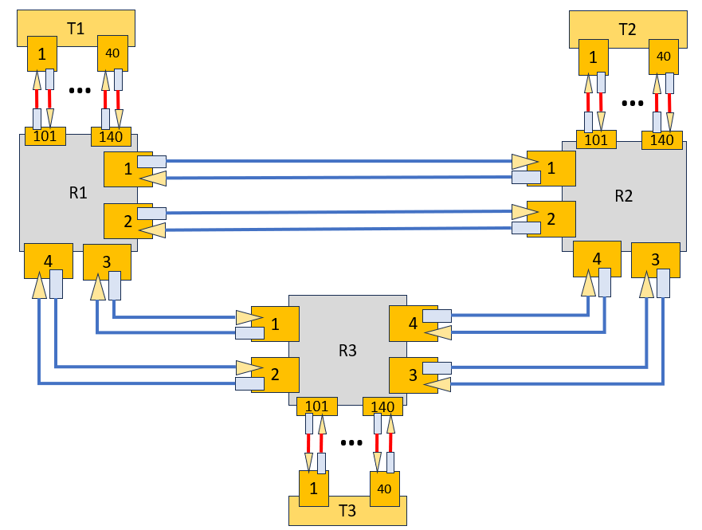

# Optical Controller

This is a framework to test the optical controller for the RMSA algorithm in an isolated manner.



```bash
#create a venv
python -m venv venv

# in linux
source venv/Scripts/activate

# in windows
venv\Scripts\activate

pip install -r requirements_optical_ctrl_test.txt

python OpticalController.py
```
